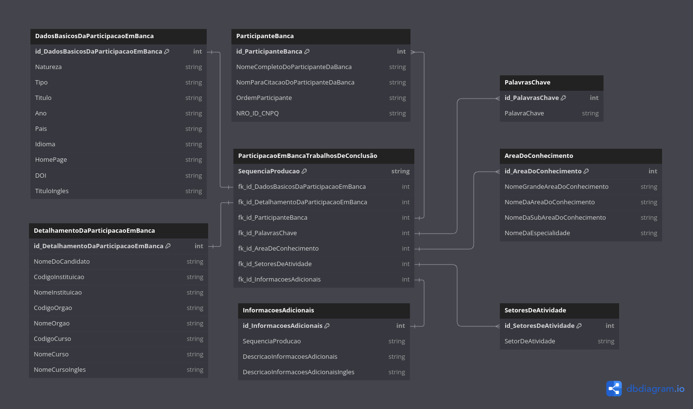

# Lattes XML Parser

-   [ ] Pesquisa: existe biblioteca/método para extração de dados do cnpq?

    -   Lattes Extrator - Ferramenta oficial extremamente burocrática do cnpq.
    -   https://github.com/jpmenachalco/scriptLattes/tree/main/scriptLattes

-   [x] Pesquisa: existe biblioteca/parser para extração de dados de arquivo XML?

    -   Bibliotecas em R para extração de dados de arquivo XML:

        -   [xml2 lib](https://xml2.r-lib.org/)
        -   [xmlconvert: xml para df](https://cran.r-project.org/web/packages/xmlconvert/xmlconvert.pdf)

- [ ] Pesquisa, é possível pular o captcha?

- [ ] Teste, interceptar as requisições e descobrir o que é enviado ao completar o captcha.

  - Playwright - biblioteca python para automação de navegadores web
  - burp - ferramenta de interceptação de requisições HTTP
  - mitmproxy - ferramenta de interceptação de requisições HTTP -->

# Tarefa 1

Extrair informações da seção: “Participação em bancas de trabalhos de conclusão”.

X-PATH ".//PARTICIPACAO-EM-BANCA-TRABALHOS-CONCLUSAO"

A tarefa final consistirá em escrever um script R para:

-   extrair todas as informações de modo estruturado
-   de várias seções diferentes (a serem especificadas ainda)
-   a partir de N arquivos XML salvos em um diretório local

<!-- [Arquivo XML para executar a tarefa](./gitignore/lattes-professor.xml) -->

Investigando a estrutura do arquivo XML manualmente e baseando-se no formulário do Lattes disponível na página de edição do currículo na plataforma do cnpq encontramos o seguinte padrão, para a seção de “Participação em bancas de trabalhos de conclusão”



Diagrama de classes do nó de Participação em trabalhos de conclusão

[Link para o diagrama feito com ferramenta disponível em **dbdiagram.io**](https://dbdiagram.io/d/681ebe855b2fc4582ffbdb8b)

A estrutura do nó consiste em um nó raiz chamado `PARTICIPACAO-EM-BANCA-TRABALHOS-CONCLUSAO` que contém os seguintes nós filhos:

-   "PARTICIPACAO-EM-BANCA-DE-MESTRADO"
-   "PARTICIPACAO-EM-BANCA-DE-DOUTORADO"
-   "PARTICIPACAO-EM-BANCA-DE-EXAME-QUALIFICACAO"
-   "PARTICIPACAO-EM-BANCA-DE-APERFEICOAMENTO-ESPECIALIZACAO"
-   "PARTICIPACAO-EM-BANCA-DE-GRADUACAO"

Cada um dos nós compartilha a mesma estrutura de filhos, assim uma classe genérica chamada `PARTICIPACAO-EM-BANCA` foi criada posibilitando a simplificação do modelo de classes.

O atributo `natureza` é comum a todos os nós e está presente na classe `DADOS-BASICOS-DE-PARTICIPACAO-EM-BANCA`, esse atributo informa se a participação foi em banca de mestrado, doutorado, exame de qualificação, aperfeiçoamento ou graduação.

---

# Como usar o script [lattes_xml.parse3.r](./lattes_xml.parse3.r)

**Nota: A estrutura ainda não reflete o modelo de classes do diagrama, mas já está funcional.**

1. Defina o currículo a ser processado.

```r
# Arquivo com o XML a ser lido
file <- xml2::read_xml("./static/cv_lattes.xml", encoding = "ISO-8859-1")
```

2. Defina o nó onde estão os dados de participação.

```r
# Nó que contém as informações de participação em bancas
node <- xml2::xml_find_all(file, ".//PARTICIPACAO-EM-BANCA-TRABALHOS-CONCLUSAO")
```

3. Defina como irá salvar os dados ( final do arquivo ).

```r
# Salvar os dados em CSV
save_as("csv")
save_as("rsqlite")
save_as("flat-excel", file_name = "flattened_cv_lattes")
```

no modo csv será criado um arquivo CSV para cada tabela, no modo rsqlite será criado um banco de dados SQLITE com as mesmas tabelas.

As tabelas são as seguintes:
- `TBL_participacao`
- `TBL_dados_basicos`
- `TBL_detalhamento`
- `TBL_participantes`
- `TBL_informacoes_adicionais`
- `TBL_setores_atividades`
- `TBL_palavras_chave`
- `TBL_area_conhecimento`

no modo `flat-excel` será criado um arquivo Excel com uma única aba contendo todos os dados, e o nome do arquivo será o especificado no parâmetro `file_name`.

**Nota: Não é necessário adicionar a extensão `.xlsx` ao nome do arquivo, o script irá adicionar automaticamente.**

4. Execute o script.

O script irá processar o arquivo XML, em um loop, e irá extrair os dado de cada nó em cada nível, e irá salvar os dados em um dataframe para cada tabela. A função `save_as` apenas irá salvar os dados no formato escolhido, seja CSV ou RSQLite.

**Nota: Certifique-se de que as bibliotecas estejam instaladas. O script tentará instalá-las automaticamente, mas se não for possível, ele encerrará com erro.**

# UUID

Para diferenciar os registros de um currículo dos outros, eu criei um UUID (Universally Unique Identifier) para cada currículo, o UUID fará a junção entre os dados das tabelas, mantendo a integridade referencial dos registros.

Por enquanto, estamos trabalhando somente com os dados da banca, por esse motivo estou usando um UUID.
Também seria possível utilizar o número da identidade presente no currículo, ou o número identificador do currículo. Mas para evitar expor dados sensíveis estou utilizando o UUID.
